# AYGO-taller2

GERMAN ANDRES LOPEZ PACHECO

1. Para inicializar este proyecto se utilizó aws-cdk, por medio del comando "cdk init app --language java" 
    escogí el lenguaje java para trabajar, al ejecutar este comando se inicializó este proyecto preconfigurado

2. La clase principal o main, contiene la configuración del Stack, la cuenta de usuario y la región que tendrá
    por defecto.

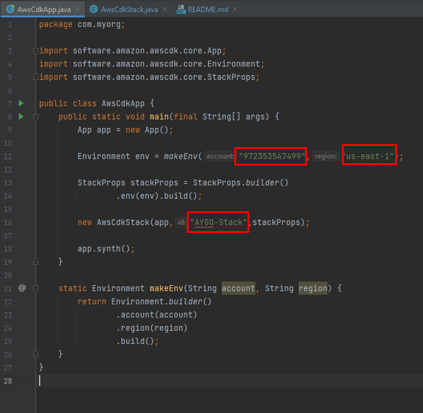

3. Luego se puede ver otra clase llamada AwsCdkStack, en la cual se van a realizar las confguraciones de las 3 instancias
    a levantar.

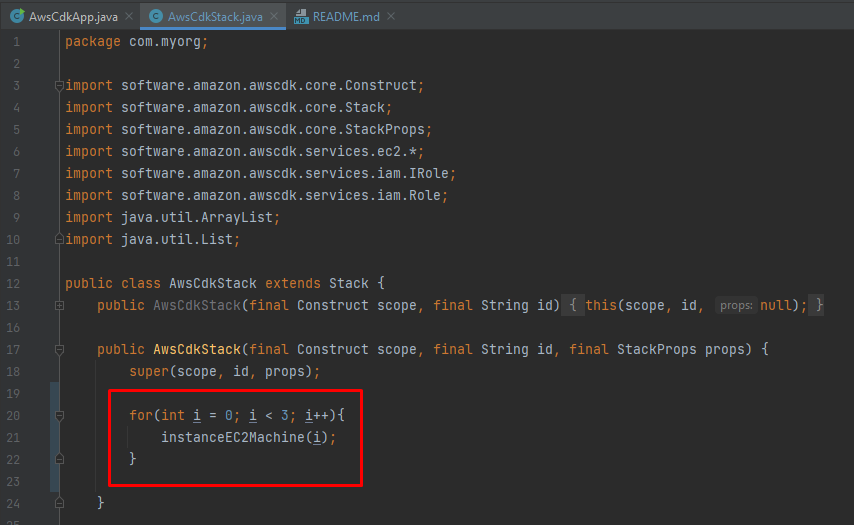

4. Se separó cada configuración por métodos, empezando por la configuración de la VPC, primero se realiza la configuración
    de la subnet, pero en este caso envés de crear una nueva, decidí por utilizar una que ya estaba creada, por lo que 
    solo necesito la subnet-id para poder instanciarla, pero le paso el index al id del subnet para que cuando instancie una 
    nueva máquina la cree con un nuevo nombre ya que no se pueden repetir los nombres de las subnet, vpc, grupos de seguridad, 
    etc.
    Luego de configurar la subnet, se realiza la configuración de la VPC, también tomé una que ya estaba creada por medio de su
    vpc-id y pasándole la subnet como parámetro y así se obtiene una VPC configurada.

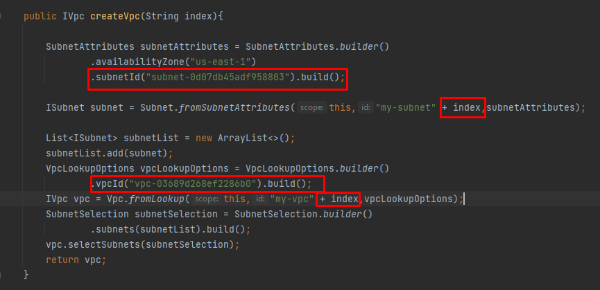

5. Para el grupo de seguridad, también tomé uno que estaba creado por medio de su sg-id, este grupo de seguridad ya tenía 
    habilitado los puertos 22 para el ssh y el 4000 para poder acceder a la aplicación que se ejecutará por docker.

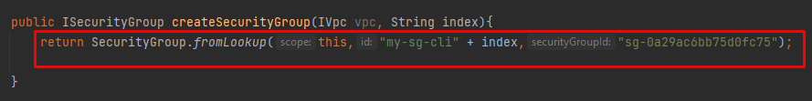

6. Para la imagen de la máquina escogí la versión latest amazon linux.

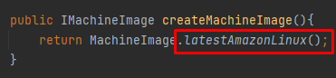

7. Toca configurar un rol con mi cuenta, que esté asociada con instancias EC2, para poderlas construir.

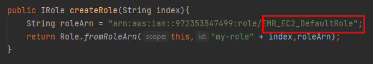

8. Para el final, se configura con que tipo de instancia se va a levantar las 3 máquinas, yo escogí "t2.micro", luego se ejecutan
    todos los métodos para generar la configuración de la instancia y por último se pueden agregar líneas de comando para poder
    configurar las instancias, entonces como se ve en la imagen, se actualiza ubuntu, se instala git, docker, se inicia el servidor de docker
    se hace clone del repositorio del taller anterior aprovechando que tiene un docker-compose.yml para levantar los servicios del LogService
    , se abre la carpeta del repositorio, se instala docker-compose, y por último se ejecuta el comando "docker-compose up" para levantar los
    contenedores con la aplicación.

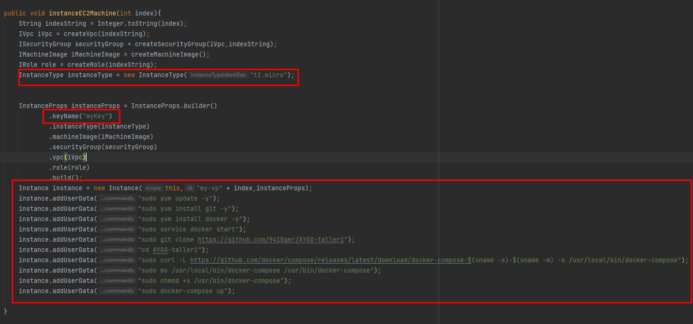

9. Para ejecutar este script, en la terminal se ejecuta el comando "cdk deploy".

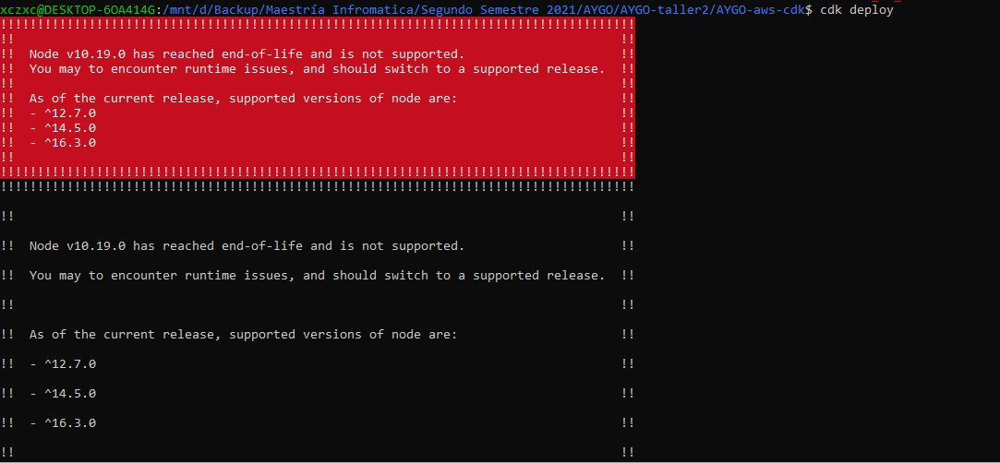

10. Se puede ver en la terminal, que se están creando las 3 instancias.

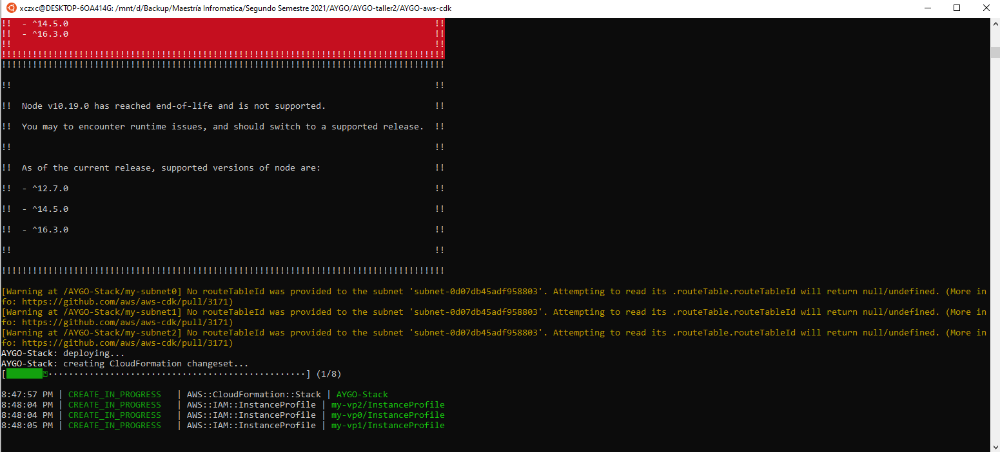

terminaron correctamente!

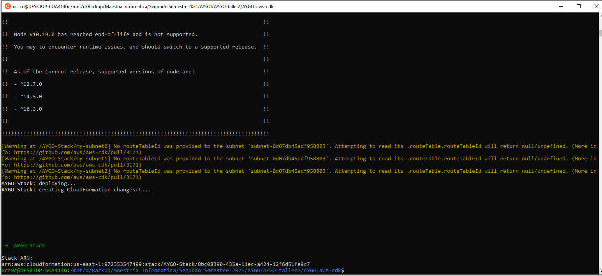

11. Se revisa en el dashboard de AWS, que efectivamente se levantaron las 3 instancias.

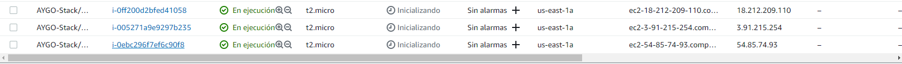

12. Por último se toma la ip pública y se les agrega ":4000/index.html" para cada una de ellas y se verifica que la aplicación ejecutó satisfactoriamente.

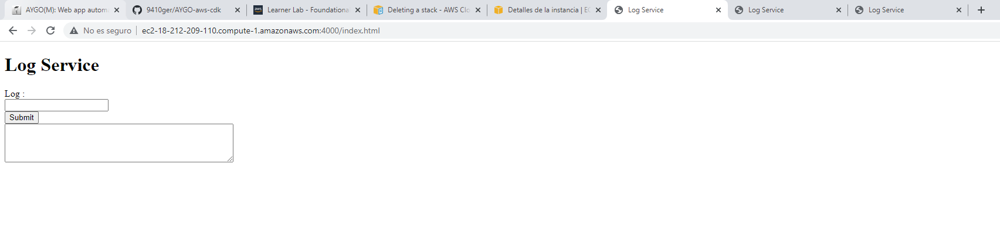

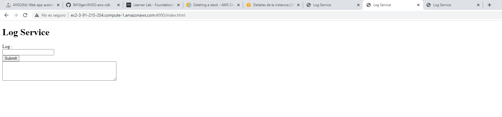

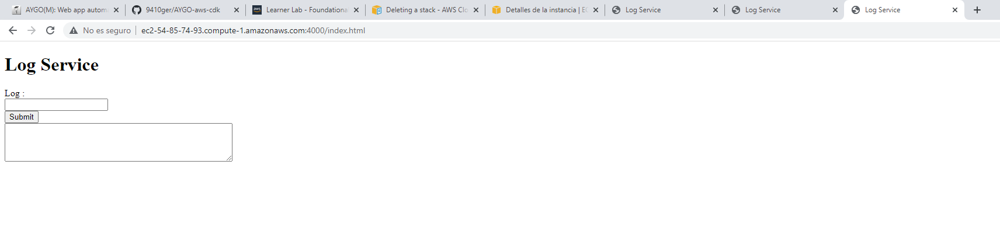